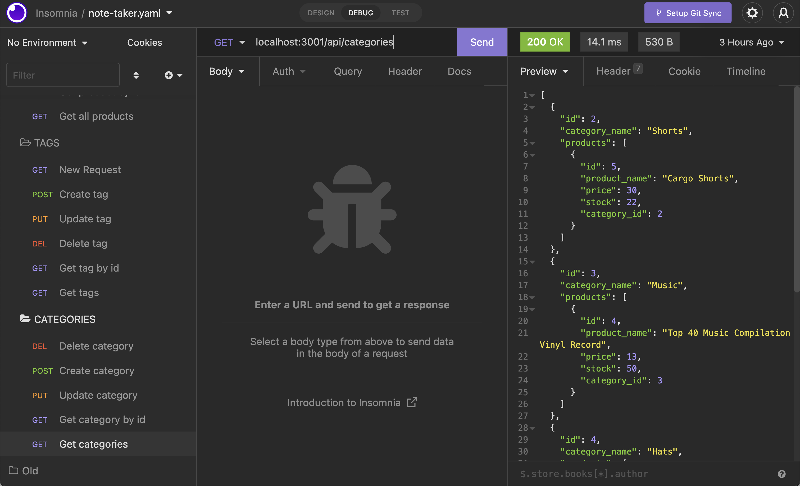

# E-Commerce Backend

### This application is a backend for getting, creating, updating, and deleting parts of an e-commerce database (i.e., products, categories, product tags, etc.). The application uses sequelize to handle the mapping and associations of the MySQL2 database.

# Stack

Express, MySQL2, Sequelize

Watch a walkthrough of how to use the application here: [https://youtu.be/geB_9Ib9YhY](https://youtu.be/geB_9Ib9YhY)

# Installation

### `npm i`

You will need to use an API client to perform CRUD operations, one such as Insomnia will suffice.

## Available Scripts

In the project directory, you can run:

### `npm start`

Open [http://localhost:3001](http://localhost:3001) to view it in your browser.
